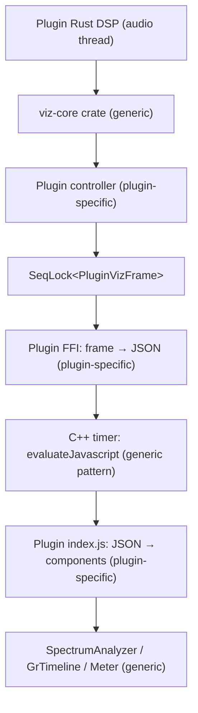

# Visualization Component Architecture

This document describes the shared visualization architecture for plugins built with the Rust DSP + WebView UI + JUCE AUv2 stack. It covers the Rust-side spectrum/metering engine, the JS-side rendering components, the per-plugin glue layers, and the data flow between them.

The goal: a new plugin reuses the generic FFT engine and JS renderers without modification. The plugin author writes only a thin glue layer (Rust controller + JS index.js) to define what signals to analyze, what data to send, and what visual style to use.

---

## Layer Diagram



There are five layers. Three are generic shared code (viz-core crate, SeqLock, JS renderers). Two are per-plugin glue (controller, JS index.js). The C++ timer is a generic pattern but lives in each plugin's PluginEditor.cpp (identical code across plugins).

---

## Layer 1: viz-core Rust Crate (Generic)

Location: `rust-dsp-crates/viz-core/` (shared crate, depended on by each plugin's DSP crate via path dependency).

### Responsibility

Accepts raw PCM samples for a single signal, performs FFT, maps FFT bins to logarithmic frequency bands, applies tilt compensation, and outputs an array of dB values. Does not know about "input", "output", "sidechain", or any plugin concept.

### Exposed Configuration

All set at construction time or via setter:

| Parameter | Type | Purpose |
|-----------|------|---------|
| `sample_rate` | `i32` | Current DAW sample rate |
| `fft_size` | `usize` | FFT window size (1024 / 2048 / 4096 / 8192). Larger = better low-frequency resolution, slower update rate |
| `hop` | `usize` | Samples between FFT computations. Smaller = faster visual update |
| `bin_count` | `usize` | Number of output log-frequency display bands (e.g. 128, 192) |
| `f_min` / `f_max` | `f64` | Frequency range of output bands (typically 20..20000 Hz) |
| `tilt_db_per_oct` | `f32` | Spectral tilt compensation slope (e.g. 4.5 dB/oct). 0 = no tilt |
| `tilt_pivot_hz` | `f64` | Tilt pivot frequency (e.g. 1000 Hz) |
| `db_floor` | `f32` | Minimum dB value (e.g. -96). Values below this are clamped |

### Interface

```rust
pub struct SpectrumEngine { ... }

impl SpectrumEngine {
    pub fn new(sample_rate: i32, config: SpectrumConfig) -> Self;
    pub fn set_sample_rate(&mut self, sample_rate: i32);
    pub fn reset(&mut self);

    // Call from audio thread. Feeds samples into ring buffer,
    // triggers FFT when hop is reached.
    pub fn feed(&mut self, samples: &[f32]);

    // Read current dB array (length = bin_count).
    // Each element is the mean power (dB) of FFT bins falling
    // within that log-frequency display band, plus tilt compensation.
    pub fn bins(&self) -> &[f32];
}
```

Each call to `feed()` may or may not trigger an FFT (depends on hop). After an FFT, `bins()` reflects the new spectrum. Between FFTs, `bins()` returns the previous result.

### Additional Utilities in viz-core

**PeakMeter**: stateless per-block peak/RMS measurement.

```rust
pub struct PeakMeter;
impl PeakMeter {
    pub fn measure(samples: &[f32]) -> (f32 /* peak */, f32 /* rms */);
}
```

**SeqLock\<T\>**: generic single-writer single-reader lock-free snapshot, usable with any `Copy` type. The audio thread writes, the UI thread reads. No heap allocation, no mutex.

```rust
pub struct SeqLock<T: Copy> { ... }
impl<T: Copy> SeqLock<T> {
    pub fn new(initial: T) -> Self;
    pub fn write(&self, value: &T);  // audio thread only
    pub fn read(&self) -> T;         // UI thread only
}
```

---

## Layer 2: Plugin Controller (Plugin-Specific)

Location: each plugin's DSP crate (e.g. `rust-dsp-crates/debess/debess-rs/src/controller.rs`).

### Responsibility

Composes one or more `SpectrumEngine` instances from viz-core, defines the plugin's `VizFrame` struct (what data the UI needs), and publishes it via `SeqLock<VizFrame>`.

This is where plugin-specific visualization logic lives:
- How many spectrum engines to create (one for input? one for output? one for sidechain?)
- Whether to measure output directly or derive it from input + filter frequency response
- What scalar metrics to include (GR, levels, threshold, etc.)
- How to smooth or combine values

### Example: DeBess

DeBess uses one `SpectrumEngine` for the input signal. The output spectrum is derived mathematically from the input spectrum and the de-esser's transfer function H(f), guaranteeing output <= input at every frequency.

```rust
pub struct DeBessVizFrame {
    pub input_db: [f32; 192],
    pub output_db: [f32; 192],
    pub gr_db: f32,
    pub input_level: f32,
    pub output_level: f32,
}
```

### Example: Hypothetical Compressor

A compressor might use two `SpectrumEngine` instances (pre/post) and measure GR differently:

```rust
pub struct CompVizFrame {
    pub pre_db: [f32; 128],
    pub post_db: [f32; 128],
    pub gr_db: f32,
    pub threshold_db: f32,
}
```

### Example: Hypothetical EQ

An EQ might use two `SpectrumEngine` instances and also compute its own frequency response curve (not from FFT, from the filter coefficients):

```rust
pub struct EqVizFrame {
    pub pre_db: [f32; 192],
    pub post_db: [f32; 192],
    pub eq_curve_db: [f32; 192],
}
```

---

## Layer 3: FFI + JSON Serialization (Plugin-Specific)

Location: each plugin's FFI crate (e.g. `plugins/DeBess/dsp/src/lib.rs`).

### Responsibility

Reads the `SeqLock<VizFrame>` snapshot and serializes it to a JSON string. The JSON schema is entirely determined by the plugin's VizFrame struct. There is no cross-plugin JSON standard.

The function returns a `*const c_char` that remains valid until the next call (cached in the engine struct).

### DeBess JSON Example

```json
{"in":[-45.2,-42.1,...],"out":[-48.3,-45.0,...],"gr":3.21,"il":0.45,"ol":0.38}
```

### Hypothetical EQ JSON Example

```json
{"pre":[-30.1,...],"post":[-28.4,...],"curve":[0.0,0.5,1.2,...]}
```

The JSON keys, array lengths, and field names are arbitrary. The only consumer is the same plugin's `index.js`, which the plugin author writes alongside the FFI code.

---

## Layer 4: C++ Timer Bridge (Generic Pattern)

Location: each plugin's `PluginEditor.cpp`. The code is nearly identical across plugins.

```cpp
void PluginEditor::timerCallback()
{
    const char* json = audioProcessor.getVizJson();
    if (json && json[0] != '\0')
    {
        juce::String js = "window.__pluginViz('" + juce::String(json) + "')";
        webView.evaluateJavascript(js, nullptr);
    }
}
```

Timer runs at ~30 Hz (configurable via `startTimerHz()`). The JS function name (`__pluginViz`, `__debessViz`, etc.) is chosen by each plugin's index.js.

---

## Layer 5: JS Rendering Components (Generic)

Location: shared directory (e.g. `shared/ui/viz/`), referenced by each plugin's CMakeLists.txt for BinaryData embedding.

### SpectrumAnalyzer

Constructor config (all optional with defaults):

| Parameter | Type | Purpose |
|-----------|------|---------|
| `fMin` / `fMax` | number | Frequency axis range (Hz). Must match Rust `f_min`/`f_max` |
| `dbMin` / `dbMax` | number | Vertical axis range (dB) |
| `binCount` | number | Expected input array length. Must match Rust `bin_count` |
| `releaseDbPerSec` | number | Ballistics: how fast the display falls back (dB/s). 0 = instant |
| `series` | array | Curve definitions (see below) |
| `diffFill` | object | Difference fill between two series (e.g. reduction shading) |
| `gridColor` / `gridColorMajor` / `labelColor` / `font` | string | Grid visual style |
| `freqLines` / `freqLabels` / `dbStep` | array/object/number | Grid tick configuration |
| `padTop` / `padBottom` | number | Vertical padding fractions |

Each series entry:

```js
{ key: 'input', color: 'rgba(120,170,200,0.5)', lineWidth: 1.1,
  fill: true, fillTopColor: '...', fillBottomColor: '...' }
```

Runtime interface:

- `setSeries(key, Float32Array)` — feed data for one curve. Key must match a series definition.
- `start()` / `stop()` — begin/end requestAnimationFrame render loop.

The component has no knowledge of what the series represent. "input", "output", "sidechain", "eq_curve" are just string keys. Visual meaning comes entirely from the color/style config and the plugin's legend HTML.

Rendering features:
- Quadratic Bezier midpoint interpolation (smooth curves, not polylines)
- Per-series vertical gradient fill
- Difference fill between any two series (e.g. input-output reduction area)
- Per-bin fast-attack slow-release ballistics (peak-with-decay)
- Log-frequency grid with configurable tick marks and labels
- dB grid with configurable step size
- HiDPI aware (devicePixelRatio)

### GrTimeline

Scrolling horizontal timeline of a scalar value (typically gain reduction).

Config: `historyLen` (number of frames to retain), `grMaxDb` (vertical scale), colors.

Runtime: `push(gr, level)` — append one frame. `start()` / `stop()`.

### Meter

Vertical bar meter with smoothing and decay.

Config: `smooth` (attack coefficient), `decay` (fall rate per frame).

Runtime: `set(value)` — value in 0..1 range.

---

## Per-Plugin Glue: JS index.js (Plugin-Specific)

Location: each plugin's `Source/ui/public/js/index.js`.

This file is the only place that knows:
1. The JSON schema coming from Rust
2. Which generic components to instantiate and with what visual config
3. How to map JSON fields to component inputs

### DeBess Example (abridged)

```js
const spectrum = new SpectrumAnalyzer(canvas, {
    binCount: 192, fMin: 20, fMax: 20000, dbMin: -90, dbMax: 6,
    series: [
        { key: 'input', color: 'rgba(120,170,200,0.5)', lineWidth: 1.1 },
        { key: 'output', color: '#5ac8e0', lineWidth: 1.8,
          fill: true, fillTopColor: 'rgba(90,200,224,0.30)',
          fillBottomColor: 'rgba(90,200,224,0.02)' },
    ],
    diffFill: { from: 'input', to: 'output', color: 'rgba(232,68,90,0.16)' },
});

window.__debessViz = function(json) {
    let d = JSON.parse(json);
    spectrum.setSeries('input', d.in);
    spectrum.setSeries('output', d.out);
    timeline.push(d.gr, d.il);
    grMeter.set(d.gr / 24);
};
```

A different plugin would instantiate the same SpectrumAnalyzer class with different series keys, different colors, and a different JSON-to-component mapping function.

---

## Constant Alignment

Certain constants must match between Rust and JS. These are not synchronized automatically; the plugin author ensures they match when writing the glue layers.

| Constant | Rust location | JS location |
|----------|--------------|-------------|
| bin_count | viz-core `SpectrumConfig` | `index.js` constructor `binCount` |
| f_min / f_max | viz-core `SpectrumConfig` | `index.js` constructor `fMin` / `fMax` |
| db_floor | viz-core `SpectrumConfig` | `index.js` constructor `dbMin` |

If the Rust side produces 192 bins covering 20-20000 Hz, the JS side must be configured with `binCount: 192, fMin: 20, fMax: 20000`. Mismatches cause the spectrum to display at wrong frequencies or with wrong resolution, but do not crash.

---

## File Placement

```
rust-dsp-crates/
  viz-core/
    Cargo.toml
    src/
      lib.rs            # re-exports
      spectrum.rs       # SpectrumEngine
      seqlock.rs        # SeqLock<T>
      meter.rs          # PeakMeter

shared/
  ui/
    viz/
      spectrum.js       # SpectrumAnalyzer class
      timeline.js       # GrTimeline class
      meter.js          # Meter class

plugins/DeBess/
  dsp/
    Cargo.toml          # depends on debess-rs + viz-core
    src/lib.rs          # FFI including debess_get_viz_json
  Source/
    ui/public/
      js/
        index.js        # plugin-specific glue (JSON→components, knob wiring)
        knob.js         # plugin-specific knob rendering (optional, could also be shared)
        format.js       # plugin-specific parameter formatting
      css/
        style.css       # plugin-specific theme
      index.html        # plugin-specific layout
  CMakeLists.txt        # references shared/ui/viz/*.js for BinaryData
```

Each plugin's CMakeLists.txt includes the shared JS files:

```cmake
juce_add_binary_data(DeBess_WebUI
    SOURCES
        ../../shared/ui/viz/spectrum.js
        ../../shared/ui/viz/timeline.js
        ../../shared/ui/viz/meter.js
        Source/ui/public/index.html
        Source/ui/public/js/index.js
        Source/ui/public/js/knob.js
        Source/ui/public/js/format.js
        Source/ui/public/css/style.css
)
```

---

## What Each Layer Does NOT Do

- **viz-core** does not manage multiple signals, does not define VizFrame structs, does not serialize JSON, does not know about plugin parameters.
- **JS renderers** do not parse JSON, do not know parameter names, do not know what "input" or "output" means semantically.
- **Plugin controller** does not do FFT math (delegates to viz-core), does not render anything.
- **Plugin index.js** does not do DSP or FFT, does not define rendering algorithms (delegates to generic components).
- **C++ timer** does not interpret the JSON content, just passes it through.
