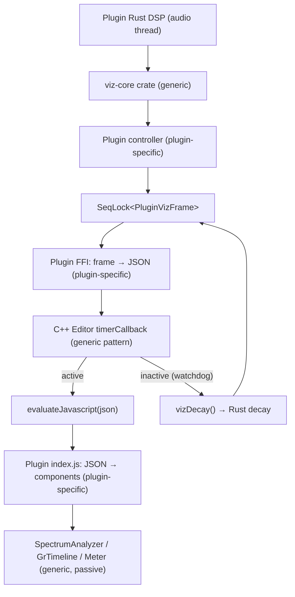

# Visualization Component Architecture

Shared visualization architecture for plugins built with the Rust DSP + WebView UI + JUCE AUv2 stack.

A new plugin reuses the generic FFT engine and JS renderers without modification. The plugin author writes only a thin glue layer (Rust controller + JS index.js) to define what signals to analyze, what data to send, and what visual style to use.

---

## Overview

Five layers. Three are generic shared code, two are per-plugin glue.



Key design principles:

- **Temporal smoothing is in Rust (linear power domain), not JS.** JS renderers are stateless — they draw whatever data they receive, no ballistics.
- **DAW pause detection is in C++ (watchdog timer).** Logic Pro stops calling `processBlock` on pause; C++ detects this and drives Rust-side decay.
- **JSON schema is per-plugin, not standardized.** Each plugin defines its own VizFrame and JSON format. The JS glue layer in each plugin's `index.js` maps JSON fields to generic components.

---

## Layer 1: viz-core Rust Crate (Generic)

Location: `rust-dsp-crates/viz-core/`

### SpectrumEngine

Accepts raw PCM samples, performs FFT, maps FFT bins to logarithmic frequency bands, applies tilt compensation, performs per-bin temporal smoothing in linear power domain, and outputs an array of smoothed dB values. Does not know about "input", "output", "sidechain", or any plugin concept.

#### Configuration

| Parameter | Type | Purpose |
|-----------|------|---------|
| `sample_rate` | `i32` | Current DAW sample rate |
| `fft_size` | `usize` | FFT window size (1024 / 2048 / 4096 / 8192) |
| `hop` | `usize` | Samples between FFT computations |
| `bin_count` | `usize` | Number of output log-frequency display bands |
| `f_min` / `f_max` | `f64` | Frequency range (typically 20..20000 Hz) |
| `tilt_db_per_oct` | `f32` | Spectral tilt compensation slope (e.g. 4.5 dB/oct) |
| `tilt_pivot_hz` | `f64` | Tilt pivot frequency (e.g. 1000 Hz) |
| `db_floor` | `f32` | Minimum dB value (e.g. -96) |
| `attack_ms` | `f32` | EMA attack time constant (0 = instant) |
| `release_ms` | `f32` | EMA release time constant (e.g. 300ms) |

#### Interface

```rust
impl SpectrumEngine {
    pub fn new(sample_rate: i32, config: SpectrumConfig) -> Self;
    pub fn set_sample_rate(&mut self, sample_rate: i32);
    pub fn reset(&mut self);
    pub fn feed(&mut self, samples: &[f32]);
    pub fn smoothed_bins(&self) -> &[f32];
    pub fn decay_to_silence(&mut self);
}
```

#### Temporal Smoothing

Smoothing happens inside `compute_spectrum()`, after FFT and band aggregation, before writing to `bins`:

1. FFT → |X[k]|²
2. Per-band mean power aggregation
3. Per-bin EMA: `smoothed = alpha * prev + (1 - alpha) * raw_power`
   - Attack: instant (alpha = 0)
   - Release: `alpha = exp(-1 / (tau * frame_rate))`, default 300ms
4. Power → dB + tilt compensation → write `bins`

Domain is linear power, not dB. Smoothing in dB biases toward peaks.

Frame rate = `sample_rate / hop` (e.g. 48000/512 ≈ 94 Hz), higher than display rate (30 Hz).

#### DAW Pause Decay

`decay_to_silence()` is called by the C++ watchdog (Layer 4) when `processBlock` stops. It applies release-rate decay to `smooth_power` and recalculates dB.

Because the C++ timer runs at ~30 Hz but `release_coeff` is calculated for the FFT frame rate (~94 Hz), each timer tick must compensate by applying multiple frames of decay: `coeff = release_coeff.powi(ceil(fft_frame_rate / 30))`.

### SeqLock\<T\>

Generic single-writer (audio thread) single-reader (UI thread) lock-free snapshot. No heap allocation, no mutex.

```rust
impl<T: Copy> SeqLock<T> {
    pub fn new(initial: T) -> Self;
    pub fn write(&self, value: &T);  // audio thread only
    pub fn read(&self) -> T;         // UI thread only
}
```

### PeakMeter

Stateless per-block peak/RMS measurement.

```rust
impl PeakMeter {
    pub fn measure(samples: &[f32]) -> (f32 /* peak */, f32 /* rms */);
}
```

---

## Layer 2: Plugin Controller (Plugin-Specific)

Location: each plugin's DSP crate (e.g. `rust-dsp-crates/debess/debess-rs/src/viz.rs`).

Composes one or more `SpectrumEngine` instances, defines the plugin's `VizFrame` struct, and publishes it via `SeqLock<VizFrame>`.

Plugin-specific logic:
- How many spectrum engines (one for input? two for pre/post?)
- Whether to measure output directly or derive it from input + transfer function
- What scalar metrics to include (GR, levels, threshold, etc.)
- `decay()` method for DAW pause: calls `engine.decay_to_silence()` + decays scalar metrics

### Example: DeBess

One `SpectrumEngine` for input. Output spectrum derived from input × H(f), guaranteeing output ≤ input.

```rust
pub struct VizFrame {
    pub input_db: [f32; 192],
    pub output_db: [f32; 192],
    pub gr_db: f32,
    pub input_level: f32,
    pub output_level: f32,
    pub active: bool,
}
```

`active` indicates whether `processBlock` is calling `feed()`. `false` = decay mode.

---

## Layer 3: FFI + JSON Serialization (Plugin-Specific)

Location: each plugin's FFI crate (e.g. `plugins/DeBess/dsp/src/lib.rs`).

Reads `SeqLock<VizFrame>`, serializes to JSON. Schema is per-plugin.

Each plugin exposes two FFI functions:
- `plugin_get_viz_json()` — read snapshot + serialize (returns `*const c_char`, valid until next call)
- `plugin_viz_decay()` — drive one decay frame (called by C++ watchdog)

### DeBess JSON

```json
{"in":[-45.2,...],"out":[-48.3,...],"gr":3.21,"il":0.45,"ol":0.38,"a":1}
```

`"a"` (0 or 1) reflects `VizFrame::active`.

---

## Layer 4: C++ Timer Bridge with Watchdog (Generic Pattern)

Location: each plugin's `PluginProcessor.cpp` and `PluginEditor.cpp`. Code is nearly identical across plugins.

### Processor

```cpp
// PluginProcessor.h
std::atomic<double> lastProcessBlockTime { 0.0 };

// PluginProcessor.cpp
void processBlock(...) {
    lastProcessBlockTime.store(
        juce::Time::getMillisecondCounterHiRes(),
        std::memory_order_relaxed);
    // ... normal processing
}

void vizDecay() {
    plugin_viz_decay(dspEngine);
}
```

### Editor

```cpp
void timerCallback() {
    double now = juce::Time::getMillisecondCounterHiRes();
    double elapsed = now - audioProcessor.lastProcessBlockTime.load(
        std::memory_order_relaxed);
    if (elapsed > 200.0)
        audioProcessor.vizDecay();

    const char* json = audioProcessor.getVizJson();
    if (json) {
        juce::String js = "if(window.__pluginViz){window.__pluginViz('"
            + juce::String(json) + "');}";
        webView->evaluateJavascript(js);
    }
}
```

Timer runs at ~30 Hz (`startTimerHz(30)`). When `processBlock` has not been called for 200ms (Logic Pro pause), the watchdog drives Rust-side decay.

---

## Layer 5: JS Rendering Components (Generic, Passive)

Location: `shared/ui/viz/`, referenced by each plugin's CMakeLists.txt for BinaryData embedding.

All components are stateless passive renderers — no temporal smoothing, no ballistics.

### SpectrumAnalyzer

| Config | Type | Purpose |
|--------|------|---------|
| `fMin` / `fMax` | number | Frequency axis range (Hz). Must match Rust config |
| `dbMin` / `dbMax` | number | Vertical axis range (dB) |
| `binCount` | number | Expected array length. Must match Rust `bin_count` |
| `series` | array | Curve definitions: `{ key, color, lineWidth, fill, fillTopColor, fillBottomColor }` |
| `diffFill` | object | Difference fill between two series: `{ from, to, color }` |
| `gridColor` / `gridColorMajor` / `labelColor` / `font` | string | Grid style |
| `freqLines` / `freqLabels` / `dbStep` | array/object/number | Grid ticks |
| `padTop` / `padBottom` | number | Vertical padding fractions |

Runtime: `setSeries(key, dbArray)`, `start()`, `stop()`.

Rendering: quadratic Bezier curves, per-series gradient fill, difference fill, log-frequency grid, dB grid, HiDPI (devicePixelRatio).

Fill paths use `_curveThrough()` (no `moveTo`) to avoid `closePath` diagonal artifacts. Stroke paths use `_tracePath()` (with `moveTo`).

### GrTimeline

Scrolling horizontal timeline of a scalar value (typically gain reduction).

Config: `historyLen`, `grMaxDb`, colors. Runtime: `push(gr, level)`, `start()`, `stop()`.

### Meter

Vertical bar meter with smoothing and decay.

Config: `smooth`, `decay`. Runtime: `set(value)` (0..1 range).

---

## Per-Plugin JS Glue

Location: each plugin's `Source/ui/public/js/index.js`.

The only place that knows the JSON schema, which components to instantiate, and how to map fields to components.

```js
const spectrum = new SpectrumAnalyzer(canvas, {
    binCount: 192, fMin: 20, fMax: 20000, dbMin: -90, dbMax: 6,
    series: [
        { key: 'input', color: 'rgba(120,170,200,0.5)', lineWidth: 1.1 },
        { key: 'output', color: '#5ac8e0', lineWidth: 1.8,
          fill: true, fillTopColor: 'rgba(90,200,224,0.30)',
          fillBottomColor: 'rgba(90,200,224,0.02)' },
    ],
    diffFill: { from: 'input', to: 'output', color: 'rgba(232,68,90,0.16)' },
});

window.__debessViz = function(json) {
    let d = JSON.parse(json);
    spectrum.setSeries('input', d.in);
    spectrum.setSeries('output', d.out);
    timeline.push(d.gr, d.il);
    grMeter.set(d.gr / 24);
};
```

---

## Constant Alignment

These constants must match between Rust and JS (manually ensured in the glue layer):

| Constant | Rust | JS |
|----------|------|----|
| bin_count | `SpectrumConfig` | `binCount` |
| f_min / f_max | `SpectrumConfig` | `fMin` / `fMax` |
| db_floor | `SpectrumConfig` | `dbMin` |

---

## File Placement

```
rust-dsp-crates/
  viz-core/
    src/
      lib.rs            # re-exports
      spectrum.rs       # SpectrumEngine (FFT + smoothing)
      seqlock.rs        # SeqLock<T>
      meter.rs          # PeakMeter

shared/
  ui/
    viz/
      spectrum.js       # SpectrumAnalyzer (passive renderer)
      timeline.js       # GrTimeline
      meter.js          # Meter

plugins/<PluginName>/
  dsp/
    src/lib.rs          # FFI: plugin_get_viz_json + plugin_viz_decay
  Source/
    PluginProcessor.h   # lastProcessBlockTime atomic + vizDecay()
    PluginEditor.cpp    # timerCallback with watchdog
    ui/public/
      js/index.js       # plugin-specific glue (JSON → components)
  CMakeLists.txt        # references ../../shared/ui/viz/*.js for BinaryData
```

---

## Layer Responsibilities

| Layer | Does | Does NOT do |
|-------|------|-------------|
| **viz-core** | FFT, bin aggregation, tilt, temporal smoothing | Manage multiple signals, define VizFrame, serialize JSON, know about plugin parameters |
| **Plugin controller** | Compose SpectrumEngine(s), define VizFrame, derive output spectrum, publish via SeqLock | FFT math, rendering |
| **Plugin FFI** | Serialize VizFrame to JSON, expose decay function | Interpret data semantically |
| **C++ timer** | Forward JSON to JS, detect DAW inactivity via watchdog, drive decay | Interpret JSON content, do any computation |
| **JS renderers** | Render data arrays to Canvas | Parse JSON, know parameter names, do temporal smoothing |
| **Plugin index.js** | Parse JSON, instantiate renderers with visual config, map fields to components | DSP, FFT, define rendering algorithms |
